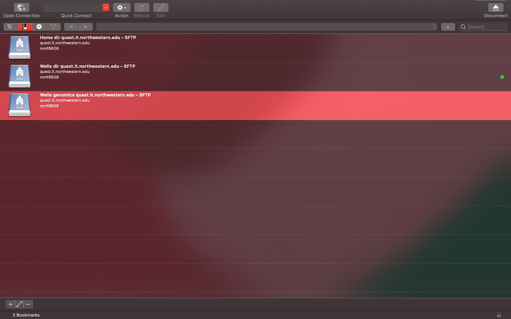
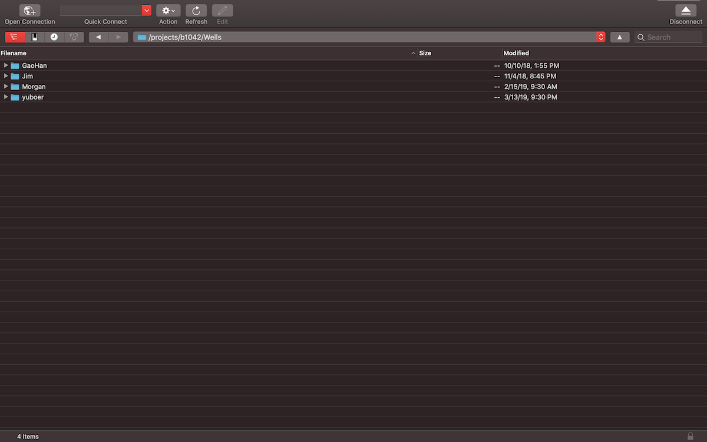

# Metagenomics analysis on Quest - work in progress :)

This document is meant to be a resource for learning the basics of metagenomics analysis using a high performance computing cluster like Northwestern's [**Quest**](https://www.it.northwestern.edu/research/user-services/quest/). This document heavily relies on the pipeline documented by Yubo Wang as well as notes from Morgan Petrovich and Jim Griffin.  

This document contains the following sections:

[Getting started](#getting-started) - Background and what you should download before starting  
[Quest basics](#quest-basics) - Submitting a job, basic commands, and other programming tools  
[Metagenomics pipeline](#metagenomics-pipeline) - Steps and programs needed to turn raw data into assembled genomes  
[Other analyses](#other-analyses) - More things to do besides assembling genomes  
[Resources](#resources) - Resources for learning more about metagenomics and programming  

---

## Getting started   
Metagenomics is a tool for the analysis of microbiological samples of natural and engineered environments. It is a popular tool in the biotechnology and wastewater fields as it can be used to capture the diversity of a microbial community, detect unculturable microbes, and provide information on functional genes and metabolic pathways (Sharpton, 2014). The usefulness of metagenomics is dependent on turning raw sequence data into usable sequences and assemblies, which requires considerable memory and computational power. Although it is possible to run metagenomics programs on your own computer, it is easier and faster to use a high performance computing cluster like Northwestern's [Quest](https://www.it.northwestern.edu/research/user-services/quest/) or a service like [KBase](https://kbase.us). This guide and collection of code primarily uses Quest to perform metagenomic analysis, although the code can certainly adapted for use on other high performance computing clusters or other computers. Many of these programs are also available as modules on KBase, which is a GUI-based system.

### Quest
To get started with Quest, you need to request access to allocations by completing a form. As of July 2020, you can go to the main [Quest homepage](https://www.it.northwestern.edu/research/user-services/quest/) and fill out the "Join an existing allocation" form under the "Apply, Renew, or Join an Allocation" link. You should do this before starting anything else in this guide, as this can take a few days to get approved.

The Wells group uses the following allocations:  
- b1052: This is the Wells group Quest allocation and is a good place to store sequence data and project files. We have 4000 GB in this allocation. George Wells (george.wells@northwestern.edu) is the allocation manager.
- b1042: This is the Genomics allocation, which is supported through the Feinberg School of Medicine. This is a good place to temporarily store working files when you submit jobs. This should not be relied on for long term storage. Janna Nugent (janna.nugent@northwestern.edu) is the allocation manager.

You will also be assigned your own allocation, which has 80 GB of storage and is good for storing scripts and programs.  

You should plan on attending an introduction to Quest workshop and reviewing the [Quest user guide](https://kb.northwestern.edu/quest). There is also a separate orientation for the Genomics cluster, which you should be invited to after requesting access to the b1042 allocation. These orientations will provide information on the basics of Quest and how it works, writing and submitting jobs, and basic troubleshooting. You can also request individual [consultations](https://www.it.northwestern.edu/research/consult-support.html) with Research Computing Services to learn more and talk through specific questions or issues.  

### Other programs  
Once you submit the join allocation request, you should also download a few programs to help you along the way. The most important programs are related to file management, text editing, and programming.

**File management**: Rather than navigating files on Quest allocations through command line, you can access them using a normal GUI-based file system. [Cyberduck](https://cyberduck.io) is a free program that connects directly to Quest allocation storage. You can move files directly between your computer to Quest using Cyberduck.

  

You can also access Quest files using an online service called [Globus](https://kb.northwestern.edu/page.php?id=71271). I personally prefer using Cyberduck because it navigates exactly like my computer file explorer, but you may prefer Globus over Cyberduck. Either way, make sure to get familiar with a file management system to more seamlessly move files between your computer and Quest.

**Text editing**: To write and edit scripts and job submissions, you will need to use some kind of text editor. You can use a basic text editing software like Text Edit on Mac or Notepad on Windows for this purpose. However, there are a lot of text editing programs that are specifically designed for writing code and provide helpful features like color coding, recalling variable names, GitHub integration, and recognizing programming languages. I use [Atom](https://atom.io), but there are many options available. If you use other programming languages with IDEs like RStudio or Jupyter Lab, you may also be able to write job submission scripts in these programs as well (just make sure to save your scripts as bash .sh files).

**Programming**: Although this guide is primarily focused on writing bash scripts for Quest job submissions, you may eventually need to write codes in another programming language, most likely Python. The easiest way to get started with Python is downloading [Anaconda](https://www.anaconda.com/products/individual), a package manager that includes Python and the popular Jupyter Notebook and Jupyter Lab programs. If you don't have programming experience in any language, attending a class or workshop can be the best way to get started. There is an [intro to computer programming course](https://www.mccormick.northwestern.edu/computer-science/academics/courses/descriptions/110.html) through Northwestern's Computer Science department that is based on Python and assumes you have no prior knowledge of programming. If you can't commit to a quarter-long class, there are a lot of great [workshops](https://www.it.northwestern.edu/research/training.html) put on by Research Computing Services (RCS) at Northwestern. There are also a ton of online resources that you can take at your own pace (many of which are compiled by RCS [here](https://sites.northwestern.edu/researchcomputing/2020/03/31/online-learning-resources-python/)). One of the most polished of these online resources is [DataCamp](). While most of the features of DataCamp require a paid subscription, Northwestern provides limited paid access every quarter, which you can apply for [here](https://www.it.northwestern.edu/research/campus-events/data-camp.html).

**GitHub**: This repository is hosted on [GitHub](https://github.com) and many metagenomics programs and projects are publicly available through GitHub. Although you don't need an account to access repositories, programs, or users, it is easiest to keep up to date on programs and updates with an account. You can also use GitHub to store and manage your own code. When you first sign up with Github, there is a helpful tutorial that walks you through the basics. You can also check out other helpful GitHub [guides](https://guides.github.com).

---
## Quest basics   

Useful commands 

`ssh -X NETID@quest.it.northwestern.edu`

`cd /projects/b1052/Wells_b1042/McKenna/...` - cd sets file path

`pwd` - prints current working directory

`sacct -X` - see what jobs are running and pending

`module avail` - show all available modules

`module avail KEYWORD` - searches all available modules

`module load MODULE NAME` - loads a module

`sprio -j` - shows your priority for jobs

`sbatch --test-only <job_submission_script>` - shows how long you'll wait before your job starts

`checkproject ALLOCATION` - checks the memory of the allocation

---
## Metagenomics pipeline  

1) Check quality of raw metagenome sequence data using [**FastQC**](https://www.bioinformatics.babraham.ac.uk/projects/fastqc/)
- Available as a Quest module, load it in using `module load fastqc/0.11.5`

2) Trim sequences to a certain length using [**fastx toolkit**](http://hannonlab.cshl.edu/fastx_toolkit/), convert from fq to fa if needed  
- Available as a Quest module, load it in using `module load fastx_toolkit/0.0.14`

3)  Assemble metagenome DNA raw reads to contigs using [**IDBA**](https://github.com/loneknightpy/idba), [**metaSPAdes**](https://github.com/ablab/spades) (part of the SPAdes package), or [**megahit**](https://github.com/voutcn/megahit)
- IDBA is available as a Quest module, load it in using `module load idba/2016_12`
- metaSPAdes is installed in the group Quest node and requires far more memory

4) Evaluate assembly results with [**quast**](http://quast.sourceforge.net/)
- QUAST is installed locally in the group node
- Make sure to load in these dependencies  
&nbsp;&nbsp;`module load python/anaconda3.6`  
&nbsp;&nbsp;`module load boost/1.56.0`    

5) Map the reads using [**bowtie**](http://bowtie-bio.sourceforge.net/bowtie2/index.shtml), can also normalize the length of the contigs using a RPKM script
- Available as a module in Quest. Make sure to load in bowtie2 and all dependencies.  
&nbsp;&nbsp;`module load bowtie2/2.2.6`  
&nbsp;&nbsp;`module load samtools/1.2`  
&nbsp;&nbsp;`module load perl/5.16`  

6) Bin genomes using [**metabat**](https://bitbucket.org/berkeleylab/metabat) or [**mmgenome**](http://madsalbertsen.github.io/mmgenome/)
- I've used metabat, which requires two separate steps. Metabat is available as a Quest module, while mmgenome is an R package.
- Load in metabat using `module load metabat/0.32.4`

7) Check draft genome bin quality using [**CheckM**](https://ecogenomics.github.io/CheckM/)
- Available as a Quest module, load in using `module load checkm/1.0.7`

8) Annotate the genome for potential functional roles using [**prokka**](https://github.com/tseemann/prokka) or [**kegg**](https://www.genome.jp/kegg/)
- So far I've used prokka, which is installed in the group Quest node. I think I've updated it properly, but some versions may have issues with the current perl version or the tbl2asn package within prokka. Couldn't figure out the perl version issue, but it would be good to check back in with the repo to see if it gets fixed in the next update. The tbl2asn issue can be fixed by installing [tbl2asn-forever](https://anaconda.org/bioconda/tbl2asn-forever) through conda.
- Load in these dependencies from Quest  
&nbsp;&nbsp;`module load python/anaconda3.6`  
&nbsp;&nbsp;`module load perl`

9) Annotate the phylogeny of the draft genome bins using [**GTDBTk**](https://github.com/Ecogenomics/GTDBTk) with prokka annotation
- There are some issues with newer versions of GTDBTk, specifically on high performance computers like Quest, where the classify step runs out of memory due to issues with the dependency pplacer. I'm still troubleshooting some of the suggestions from the devs using the `--scratch_dir` tag in the code (https://github.com/Ecogenomics/GTDBTk/issues/238).

10) Optional analyses (FastANI, sequence alignment, phylogentic tree, prodigal ORF annotation, Blast sequence annotation, remove ribosome RNA sequences)
- FastTree is available on Quest, though I haven't used it yet. Load it in using `module load fasttree/2.1.10`
- Blast is available on Quest, though I haven't used it yet. Load it in using `module load blast/2.7.1`

---
## Other analyses  

Can directly run raw reads through Blast to see if genes of interest are there

---
## Resources  
Helpful links:

Quest

[Quest KB home](https://kb.northwestern.edu/72406)

[KB modules management](https://kb.northwestern.edu/70718)

[KB job management](https://kb.northwestern.edu/page.php?id=70710)

Manuals

[Bowtie2](http://bowtie-bio.sourceforge.net/bowtie2/manual.shtml)
