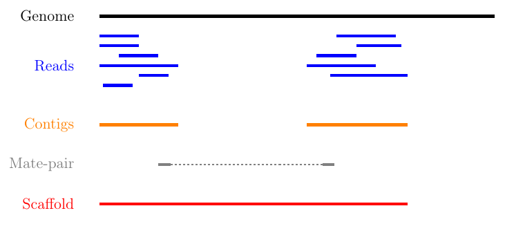

# Metagenomics analysis on Quest

This document is meant to be a resource for learning the basics of metagenomics analysis using a high performance computing cluster like Northwestern's [**Quest**](https://www.it.northwestern.edu/research/user-services/quest/). This document heavily relies on the pipeline documented by Yubo Wang as well as notes from Morgan Petrovich and Jim Griffin.  

This document contains the following sections:

[Getting started](#getting-started) - Background and what you should download before starting  
[Quest basics](#quest-basics) - Submitting a job, basic commands, and other programming tools  
[Metagenomics pipeline](#metagenomics-pipeline) - Steps and programs needed to turn raw data into assembled genomes  
[Other analyses](#other-analyses) - More things to do besides assembling genomes  
[Resources](#resources) - Resources for learning more about metagenomics and programming  

---

## Getting started   
Metagenomics is a tool for the analysis of microbiological samples of natural and engineered environments. It is a popular tool in the biotechnology and wastewater fields as it can be used to capture the diversity of a microbial community, detect unculturable microbes, and provide information on functional genes and metabolic pathways. The usefulness of metagenomics is dependent on turning raw sequence data into usable sequences and assemblies, which requires considerable memory and computational power. Although it is possible to run metagenomics programs on your own computer, it is easier and faster to use a high performance computing cluster like Northwestern's [Quest](https://www.it.northwestern.edu/research/user-services/quest/) or a service like [KBase](https://kbase.us). This guide and collection of code primarily uses Quest to perform metagenomic analysis, although the code can certainly adapted for use on other high performance computing clusters or other computers. Many of these programs are also available as modules on KBase, which is a GUI-based system.

### Quest
To get started with Quest, you need to request access to allocations by completing a form. As of July 2020, you can go to the main [Quest homepage](https://www.it.northwestern.edu/research/user-services/quest/) and fill out the "Join an existing allocation" form under the "Apply, Renew, or Join an Allocation" link. You should do this before starting anything else in this guide, as this can take a few days to get approved.

The Wells group uses the following allocations:  
- b1052: This is the Wells group Quest allocation and is a good place to store sequence data and project files. We have 4000 GB in this allocation. George Wells (george.wells@northwestern.edu) is the allocation manager.
- b1042: This is the Genomics allocation, which is supported through the Feinberg School of Medicine. This is a good place to temporarily store working files when you submit jobs. This should not be relied on for long term storage. Janna Nugent (janna.nugent@northwestern.edu) is the allocation manager.

You will also be assigned your own allocation, which has 80 GB of storage and is good for storing scripts and programs.  

You should plan on attending an introduction to Quest workshop and reviewing the [Quest user guide](https://kb.northwestern.edu/quest). There is also a separate orientation for the Genomics cluster, which you should be invited to after requesting access to the b1042 allocation. These orientations will provide information on the basics of Quest and how it works, writing and submitting jobs, and basic troubleshooting. You can also request individual [consultations](https://www.it.northwestern.edu/research/consult-support.html) with Research Computing Services to learn more and talk through specific questions or issues.  

### Other programs  
Once you submit the join allocation request, you should also download a few programs to help you along the way. The most important programs are related to file management, text editing, and programming.

**File management**: Rather than navigating files on Quest allocations through command line, you can access them using a normal GUI-based file system. [Cyberduck](https://cyberduck.io) is a free program that connects directly to Quest allocation storage. You can move files directly between your computer to Quest using Cyberduck.

  

You can also access Quest files using an online service called [Globus](https://kb.northwestern.edu/page.php?id=71271). I personally prefer using Cyberduck because it navigates exactly like my computer file explorer, but you may prefer Globus over Cyberduck. Either way, make sure to get familiar with a file management system to more easily files between your computer and Quest.

**Text editing**: To write and edit scripts and job submissions, you will need to use some kind of text editor. You can use a basic text editing software like Text Edit on Mac or Notepad on Windows for this purpose. You can also use the nano command in Quest to edit text-based files directly. However, there are a lot of text editing programs that are specifically designed for writing code and provide helpful features like color coding, recalling variable names, GitHub integration, and recognizing programming languages. I use [Atom](https://atom.io), but there are many options available. If you use other programming languages with IDEs like RStudio or Jupyter Lab, you may also be able to write job submission scripts in these programs as well.

**Programming**: Although this guide is primarily focused on writing bash scripts for Quest job submissions, you may eventually need to write codes in another programming language to perform repetitive tasks or analyze outputs. Both Python and R are very useful for bioinformatics and programming tasks overall. The easiest way to get started with Python is by downloading [Anaconda](https://www.anaconda.com/products/individual), a package manager that includes Python and the popular Jupyter Notebook and Jupyter Lab programs. The easiest way to get started with R is by [downloading base R and the RStudio IDE](https://rstudio-education.github.io/hopr/starting.html). If you don't have programming experience in any language, attending a class or workshop can be the best way to get started. There is an [intro to computer programming course](https://www.mccormick.northwestern.edu/computer-science/academics/courses/descriptions/110.html) through Northwestern's Computer Science department that is based on Python and assumes you have no prior knowledge of programming. If you can't commit to a quarter-long class, there are a lot of great [workshops](https://www.it.northwestern.edu/research/training.html) put on by Research Computing Services (RCS) at Northwestern for both Python and R. There are also a ton of online resources that you can take at your own pace (many of which are compiled by RCS [here](https://sites.northwestern.edu/researchcomputing/2020/03/31/online-learning-resources-python/)). I have some Python codes that I use for bioinformatics applications, which you can find [here](https://github.com/mckfarm/my_lib/blob/master/Python/bioinformatics.py).

**GitHub**: This repository is hosted on [GitHub](https://github.com). Likewise, many metagenomics programs are publicly available through GitHub. Although you don't need an account to access repositories or users, it is easy to keep up to date on programs and ongoing projects with an account. You can also use GitHub to store and manage your own code. When you first sign up with Github, there is a helpful tutorial that walks you through the basics. You can also check out other helpful GitHub [guides](https://guides.github.com).

---
## Quest basics   

There are a few concepts and commands that are important to using Quest.

**Command line**: Using Quest requires at least some basic knowledge of command line to log in, navigate the file system, and submit jobs, which can be intimidating if you haven't used it before. Luckily, there are a lot of resources for learning command line basics. RCS has a [helpful compilation](https://sites.northwestern.edu/researchcomputing/2020/03/20/online-learning-resources-command-line/) of basic to advanced command line resources. You will also go over some basic commands during the Quest orientation.

**Submitting jobs**: To submit a job, you need to have a bash file (just a text file with a .sh extension) with some information that gets sent to the scheduler, which directs your job to the correct nodes and puts your job into the queue based on priority. You can also submit an interactive job by simply submitting commands directly while logged into Quest, but it can be easy to lose your work and not be able to document or repeat your commands. The Quest knowledge base has a [helpful page](https://kb.northwestern.edu/page.php?id=69247) on submission scripts and the [bash folder](https://github.com/mckfarm/metagenomics/tree/master/bash) of this repo has many sample scripts to look over. There are a few key pieces that are required, as well as some optional lines that I recommend for every job submission:  

`#!/bin/bash` - needed for every submission to tell the scheduler that this is a bash job script  
`#SBATCH --job-name="job_name"` - the job name for your own reference
`#SBATCH -A b1042`- what allocation this job is in  
`#SBATCH -p genomicsguest` - the partition you will use; if you are a member of the genomics cluster and are not in Feinberg, you should use genomicsguest  
`#SBATCH -t 15:00:00` - the time you estimate for the job to run; from my experience, jobs under 4 hours tend to start running right away  
`#SBATCH -N 1`- the number of nodes the job will run on; this should generally be set to 1 unless you have figured out a way to parallelize your script to run on multiple nodes (which isn't very common)  
`#SBATCH --ntasks-per-node=24` - the number of processors your job will run on; if you submit multiple jobs at once, it may be helpful to submit your job as even intervals of 24 (4, 8, 12) so they can be scheduled to run on the same node  
`#SBATCH --mail-user=email@address` - this is entirely optional; you can have emails sent to you at certain stages of your job  
`#SBATCH --mail-type=BEGIN,END,FAIL` - if you have the line above, you need this line to specify when you want emails; I have all my job emails sent to a particular folder in my email so they don't clog my main inbox  
`#SBATCH --output=outlog_name` - saves an out log in the folder where your submission script is; I think this is optional but this is really important as some programs save outputs directly into the out log and provide information on how your job ran  
`#SBATCH --error=outlog_name` - saves an error log in the folder where your submission script is; also optional, but I highly recommend for troubleshooting and because many programs save outputs and run information directly into the error log  

**Useful commands**: There are a few handy commands for quickly accessing and navigating Quest that I've outlined below.
- `ssh -X NETID@quest.it.northwestern.edu` - This is how you log into Quest, just plug in your own NETID into the command  
- `sacct -X` - This command shows you all your current job submissions and whether they are pending, running, or failed
- `sbatch job_script.sh` - I keep a sbatch command handy when I am first submitting or troubleshooting a job so I don't have to keep typing the same command over and over  
- `sbatch --test-only job_script.sh` - This command gives you an estimate of when your job will actually start, make sure to submit a regular `sbatch job_script.sh` when you actually want to submit your script
- `cd /current/project/scripts` - I keep a set current directory command handy with the name of the folder where my project scripts are kept so I don't have to type this in every time I submit a job
- `checkproject ALLOCATION` - Check the memory of an allocation

**Modules**: The folks at Quest have preinstalled popular programs on Quest so we don't have to download, configure, and update them ourselves. These are loaded in through the `module load` command, which you will see scattered throughout this pipeline and in the batch submission scripts. To see all of the available modules in Quest (there are a lot), you can enter `module avail` in a Quest window. You can also search the available modules by adding a keyword: for example, `module avail python`.

---
## Metagenomics pipeline  

**Introduction**  

The metagenomics pipeline is a series of steps that takes raw sequence data and compiles it into genome bins. This is done with three key intermediate steps, assembly into contigs, contig assembly to scaffolds, mapping reads, and binning genomes. These steps are summarized briefly in this section of the tutorial and are described in much better detail from a variety of sources including published literature, lectures and talks, and program manuals. Some additional resources are linked at the end of this subsection.

  
(From http://marinetics.org/teaching/hts/Assembly.html)

Assembling contigs - Contigs are composed of overlapping reads. Contigs are assembled by comparing the sequence of each read and determining where they overlap. If the reads were obtained through paired end sequencing (both the foward and reverse strands were sequenced), then the assembly program can also assemble contigs to account for both strands.

Assembling scaffolds - Contigs are used to create scaffolds, which are sequences separated by gaps of known length. Contigs have unique short sequences that indicate their relative position in a whole genome sequence. These unique sequences, referred to as mate-pairs, can be used to string the contigs together into longer sequences with gaps where the contigs did not overlap. This step is optional, and many metagenomics pipelines do not assemble scaffolds at all and just use the contigs. Although assembling scaffolds can help improve assembly and binning, [scaffolds may miss key information](https://www.pacb.com/blog/genomes-vs-gennnnes-difference-contigs-scaffolds-genome-assemblies/), particularly in the assumed gaps between contigs. 

Mapping reads - Once the scaffolds have been assembled, they can be used as a reference (index) for mapping the raw reads. In other words, the raw reads are aligned to the scaffolds to fill in the gaps. The output of read mapping is an alignment file, typically a BAM or SAM, which shows how the reads map to the scaffolds. The alignment file can be used to calculate the depth and coverage, which are important for genome binning and further quality calculations.

Binning genomes - Genome bins (also known as draft genomes and metagenome-assembled genomes) are assembled from the mapping output and the contigs. Every program is slightly different in their specific approach, but generally, they rely on algorithms to group contigs into bins.

Additional resources:  

[Bioinformatics workbook](https://bioinformaticsworkbook.org/#gsc.tab=0) is a great resource for a variety of bioinformatics tutorials and information. Their metagenomics guide is similar to this document, but goes much more in depth about what the outputs of each program mean (https://bioinformaticsworkbook.org/dataAnalysis/Metagenomics/MetagenomicsP1.html#gsc.tab=0).

[R Microbiome tools](https://github.com/microsud/Tools-Microbiome-Analysis) is a collection of tools specifically designed to work in R. I'm not as familiar with bioinformatics and metagenomes specifically in R, but the list of tools is pretty extensive.

[Metagenomics wiki](https://sites.google.com/site/wiki4metagenomics/) is very simple to navigate and has simple tutorials/explanations for many of the tools recommended in this pipeline.  

[ANGUS workshop notes](https://angus.readthedocs.io/en/2019/recovering-rep-genomes-from-mgs.html#setting-up-our-working-environment) are a collection of resources from a next-gen sequencing workshop in 2019. This page has another detailed walkthrough of assembling genomes from metagenomic data, as well as a discussion of co-assembly.

Wikipedia
- Here is the wikipedia page for shotgun sequencing as a whole, which is helpful for understanding how shotgun sequencing works and the general approach for obtaining genome bins https://en.wikipedia.org/wiki/Shotgun_sequencing
- Here is the wikipedia page for contigs, another useful page for getting a general understanding of what's going on https://en.wikipedia.org/wiki/Contig

Videos, if you find audio-visual presentations more helpful
- Great summary video of how metagenome assembly works from a 2018 workshop, presentation by Dr. Laura Hug https://www.youtube.com/watch?v=BC9sxqAEs2s
- Introductory explanation of k-mers which is important for the contig assembly, presentation by Dr. Rob Edwards https://www.youtube.com/watch?v=DyZvATM9Hr8

**Pipeline**
1) Check quality of raw metagenome sequence data using [**FastQC**](https://www.bioinformatics.babraham.ac.uk/projects/fastqc/)
- Available as a Quest module, load it in using `module load fastqc/0.11.5`

2) Trim sequences to a certain length using [**fastx toolkit**](http://hannonlab.cshl.edu/fastx_toolkit/), convert from fq to fa if needed  
- Available as a Quest module, load it in using `module load fastx_toolkit/0.0.14`
- There are definitely other programs available to do this step, but this is integrated nicely into Quest

3)  Assemble metagenome DNA raw reads to contigs using [**IDBA**](https://github.com/loneknightpy/idba), [**metaSPAdes**](https://github.com/ablab/spades) (part of the SPAdes package), or [**megahit**](https://github.com/voutcn/megahit)
- IDBA is available as a Quest module, load it in using `module load idba/2016_12`
- metaSPAdes is installed in the group Quest node and requires far more memory, so much so that it may exceed Quest job limits. I've only used IDBA, but you may need to contact Quest support and request access to a larger memory node if you choose to use metaSPAdes
- Samples from the same reactor taken from multiple dates can be coassembled or assembled individually. [Coassembly](https://astrobiomike.github.io/metagenomics/metagen_anvio#what-is-a-co-assembly) essentially means using all available sequencing data to produce one reference assembly. This approach can improve the robustness of the assembly, but it may not be appropriate if the microbial communities are very different from one sampling date to another. There are no hard and fast rules to decide when to coassemble, so it may be best to coassemble and individually assemble, then compare results and make a subjective decision after the binning step. I've included scripts for coassembly and individual assembly in the scripts folder.

4) Evaluate assembly results with [**quast**](http://quast.sourceforge.net/)
- QUAST is installed locally in the group node
- Make sure to load in these dependencies in your script
&nbsp;&nbsp;`module load python/anaconda3.6`  
&nbsp;&nbsp;`module load boost/1.56.0`    

5) Map the reads using [**bowtie**](http://bowtie-bio.sourceforge.net/bowtie2/index.shtml), can also normalize the length of the contigs using a RPKM script
- Available as a module in Quest. Make sure to load in bowtie2 and all dependencies.  
&nbsp;&nbsp;`module load bowtie2/2.2.6`  
&nbsp;&nbsp;`module load samtools/1.2`  
&nbsp;&nbsp;`module load perl/5.16`  

6) Bin genomes using [**metabat**](https://bitbucket.org/berkeleylab/metabat) or [**mmgenome**](http://madsalbertsen.github.io/mmgenome/)
- I've used metabat, which requires two separate steps. Metabat is available as a Quest module, while mmgenome is an R package.
- Load in metabat using `module load metabat/0.32.4`

7) Check draft genome bin quality using [**CheckM**](https://ecogenomics.github.io/CheckM/)
- Available as a Quest module, load in using `module load checkm/1.0.7`

8) Annotate the genome for potential functional roles using [**prokka**](https://github.com/tseemann/prokka)
- Prokka is installed in the group Quest node. I had some issues previously with the current perl version and tbl2asn package within prokka. I think the issue is resolved now, but you may need to install a fresh version of prokka if you run into issues.
- Load in these dependencies from Quest  
&nbsp;&nbsp;`module load python/anaconda3.6`  
&nbsp;&nbsp;`module load perl`

9) Annotate the phylogeny of the draft genome bins using [**GTDBTk**](https://github.com/Ecogenomics/GTDBTk) with prokka annotation
- There is a documented issue with newer versions of GTDBTk on high performance computers like Quest, where the classify step runs out of memory due to issues with the dependency pplacer. This issue can be circumvented using the `--scratch_dir` tag in the command line code (https://github.com/Ecogenomics/GTDBTk/issues/238), which creates a temporary scratch file in your current directory rather than relying on the working memory that you specify in your SBATCH lines. Make sure there is enough room on whatever allocation you are using to support this temporary scratch file (~120 GB).

10) Optional analyses (FastANI, sequence alignment, phylogentic tree, prodigal ORF annotation, Blast sequence annotation, remove ribosome RNA sequences) - see next section

---
## Other analyses  

- Blast  
Blast is a program that compares sequences, whole sequenced genomes, and metagenome assembled genomes to existing sequences in databases. Blast can also be used to compare nucleotides to protein sequences as well as directly comparing protein sequences. Blast aligns your sequence to the reference sequences and provides an alignment score based on the similarity of your sequence to the reference. Blast can be run on individual .fa files from their [web interface](https://blast.ncbi.nlm.nih.gov/Blast.cgi) or you can install Blast databases and perform the alignment on Quest. Luckily, Blast is available on quest through the command `module load blast/2.7.1` and jobs can be submitted like any other program.

- MetaPOAP
MetaPOAP is a Python script that estimates the likelihood that a metabolic pathway is present in your MAG. A full explanation of the program is available [here](https://academic.oup.com/bioinformatics/article/34/24/4284/5043007) and the program Github page is [here](https://github.com/lmward/MetaPOAP). MetaPOAP requires a metabolic pathway to be represented by robust marker genes, which can be identified in a MAG using Blast. The program uses these metabolic pathway matches as well as MAG quality data from CheckM to estimate the false positive and false negative rate of detecting the metabolic pathway of interest in a MAG. This program is very lightweight and can be run on your own computer using python. You must use Python2 (latest version = Python2.7) for this program to work.

---
## Resources  
Helpful links:

Quest

[Quest KB home](https://kb.northwestern.edu/72406)

[KB modules management](https://kb.northwestern.edu/70718)

[KB job management](https://kb.northwestern.edu/page.php?id=70710)
